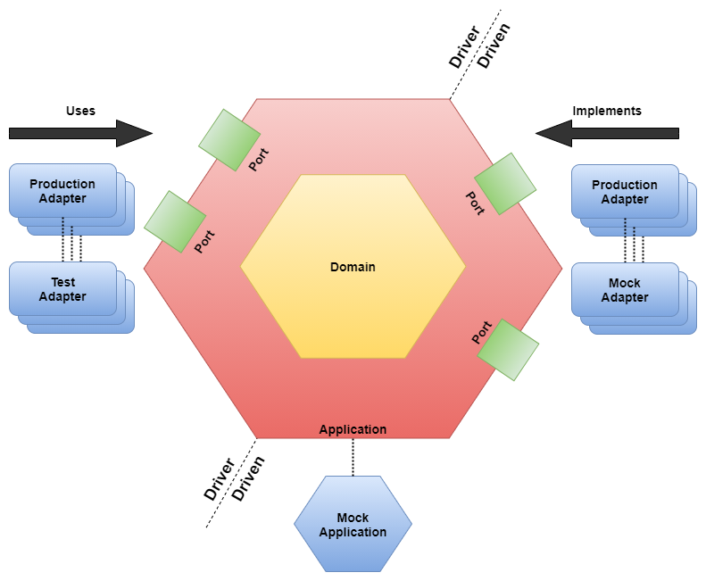

## Introduction

ftgogo (food-to-gogo) is a Golang implementation of
the [FTGO](https://github.com/microservices-patterns/ftgo-application) application described in the
book ["Microservice Patterns"](https://www.manning.com/books/microservices-patterns) by Chris Richardson.

## Purpose

This repository exists to demonstrate the patterns and processes involved when constructing a distributed application

### What you'll find in this demonstration

1. [Architecture](#architecture)
    1. [Clean Architecture](#clean-architecture)
    1. [Code Layout](#code-layout)
    1. [Services](#services)
1. [Design](#design)
    1. [CQRS](#cqrs)
    1. [Backend-For-Frontend](#backend-for-frontend-bff)
    1. [GRPC and Protocol Buffers](#grpc-and-protocol-buffers)
    1. [Testing](#testing)
        1. [Unit Tests](#unit-tests)
        1. [Integration Tests](#integration-tests)
        1. [End To End Tests](#end-to-end-tests)
1. [Other](#other)
    1. [Mono-repository](#mono-repository)
    1. [Modular-monolith](#modular-monolith)    

## Prerequisites

[Docker](https://www.docker.com/) - Everything is built and run from a docker compose environment.

## Execution

Open a command prompt and then execute the following docker command

> NOTE: The first time you bring everything up the init script for Postgres will run automatically. The services will crash-loop for a bit because of that. Eventually things will stabilize.

### Mac, Linux, and Windows Users

```bash
docker compose --profile monolith up
```

Use `Ctrl-C` to stop all services.

## Architecture

### Clean Architecture



> The colors used for each component in the above diagram align with the ring colors used in clean architecture diagram.

In this implementation
of [clean architecture](https://blog.cleancoder.com/uncle-bob/2012/08/13/the-clean-architecture.html) I am working
mainly with
[Hexagonal Architecture](https://jmgarridopaz.github.io/content/hexagonalarchitecture.html)

### CQRS

Each service divides the requests it receives into commands and queries. Using a simple design
described [here](https://threedots.tech/post/basic-cqrs-in-go/) by [Three Dots Labs](https://threedotslabs.com/) all of
our handlers can be setup to use a command or query.

This is a very limited in scope implementation
of [CQRS](https://docs.microsoft.com/en-us/azure/architecture/patterns/cqrs). It is valid in that we have two things
where before we had one. Command and query have been segregated to separate responsibilities.

### Backend-For-Frontend (BFF)

The project now demonstrates the [backend-for-frontend](https://samnewman.io/patterns/architectural/bff/) pattern with
the addition of a Customer-Web service. These types of services are purpose built API Gateways that serve a specific
client experience.

The addition of these BFFs also provide a place to implement cross-cutting concerns such as authorization and
authentication. I've tried to add demonstrations of the capabilities of what a BFF might do for a microservices
application.


### GRPC and Protocol Buffers

With the addition of the first BFF, GRPC is now used in place of HTTP by the handlers. GRPC is a
subjectively [better](https://cloud.google.com/blog/products/api-management/understanding-grpc-openapi-and-rest-and-when-to-use-them)
choice for communication between your applications Api Gateway or BFF than using HTTP with REST. The move to GRPC was
done leaving the contracts previously used by HTTP endpoints unchanged as much as possible.

### Mono-repository

This demonstration application is a mono-repository for the Golang services. I chose to use as few additional frameworks
as possible, so you'll find there is also quite a bit of shared code in packages under `/internal`

### Testing

#### End To End Tests

End-to-end written in Gherkin have been added. You can find these in the `/testing/e2e`
directories.

#### Integration Tests

Integration tests have been added to the consumer module to test gRPC and PostgreSQL server.

#### Unit Tests

Unit tests have been added to the consumer module to test the domain and application layer.
